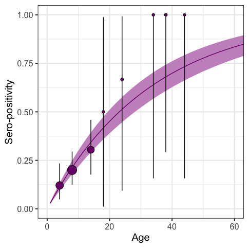
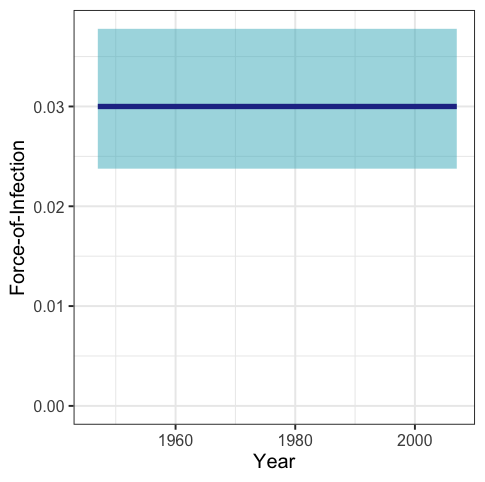
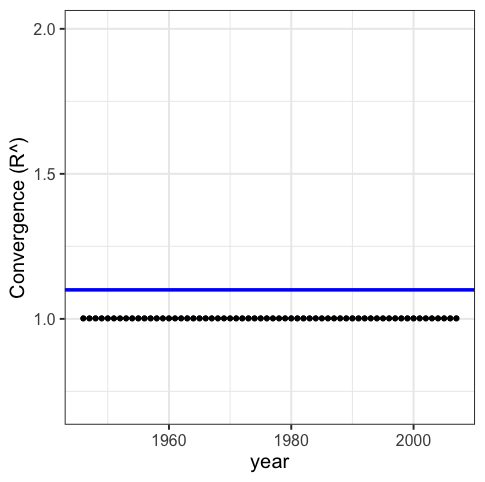
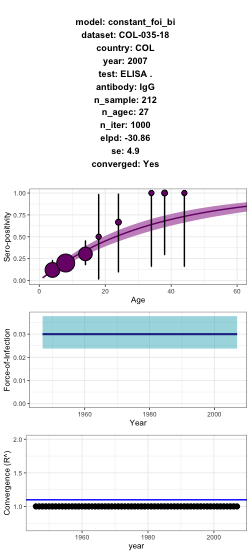

## *serofoi*

__serofoi version 0.1.0__ is an R package to estimate the *Force-of-Infection* of a given pathogen from population based sero-prevalence studies on a Bayesian framework.

<!-- badges: start -->

[](https://opensource.org/licenses/MIT)
[](https://github.com/epiverse-trace/readepi/actions/workflows/R-CMD-check.yaml)
[](https://app.codecov.io/gh/epiverse-trace/readepi?branch=main)
[](https://www.reconverse.org/lifecycle.html#concept)
<!-- badges: end -->

## Installation

You can install the **development version** of `serofoi` from
[GitHub](https://github.com/) with:

``` r
# install.packages("remotes")
remotes::install_github("TRACE-LAC/serofoi")
library(serofoi)
```

## Quick start

These examples illustrate some of the current functionalities:

The function `prepare_data()` helps the user to prepare the dataset for the use of `serofoi` package

``` r
data_test <- prepare_data(mydata)
head(data_test)
```

Current version of the package runs three different models of the FoI. The function `run_model()` allows to choose betwwen three different models.


- Constant Force-of-Infection with a binomial distribution
``` r
model_0 <- run_model(model_data = data_test,
                     model_name = "constant_foi_bi")
``` 

- Time-varying Force-of-Infection with a prior normal-binomial distribution
``` r
model_1 <- run_model(model_data = data_test,
                     model_name = "continuous_foi_normal_bi")
```

- Time-varying Force-of-Infection with a prior normal-log distribution
``` r
model_2 <- run_model(model_data = data_test,
                     model_name = "continuous_foi_normal_log")
``` 

For each model, there are three plotting functions:
```
plot_seroprev_fitted(model_0)
``` 



```
plot_foi(model_0)
``` 



```
plot_rhats(model_0)
``` 



The three plots can be obtained at once with the function `plot_model()`
``` r
plot_model(model_0)
```



Finally, the package provides a funcion `get_comparison_table()`  allows to compare these three models based on convergence, elpd and p-values

``` r
comp_table <- get_comparison_table(
  model_objects_list = c(m0 = model_0,
                         m1 = model_1,
                         m2 = model_2))
                         
``` 


### Lifecycle

This package is currently a *concept*, as defined by the [RECON software
lifecycle](https://www.reconverse.org/lifecycle.html). This means that
essential features and mechanisms are still being developed, and the
package is not ready for use outside of the development team.

### Contributions

Contributors to the project include:

- [Zulma M. Cucunubá](https://github.com/zmcucunuba) (author)
- [Nicolás Tórres](https://github.com/ntorresd) (author)
- Benjamin Lambert (author)
- Pierre Nouvellet (author)
- [Miguel Gamez](https://github.com/megamezl) (contributor)
- [Geraldine Gómez](https://github.com/GeraldineGomez) (contributor)

Contributions are welcome via [pull
requests](https://github.com/TRACE-LAC/serofoi/pulls).


### Code of Conduct

Please note that the linelist project is released with a [Contributor
Code of
Conduct](https://contributor-covenant.org/version/2/0/CODE_OF_CONDUCT.html).
By contributing to this project, you agree to abide by its terms.
